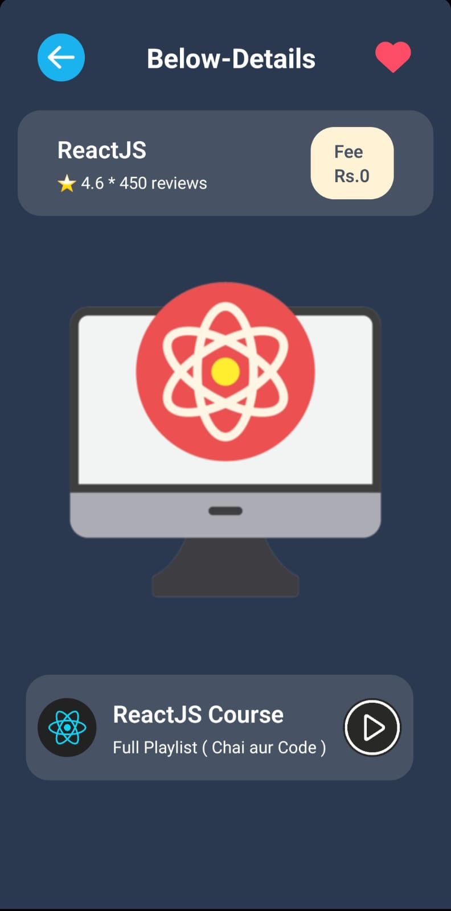
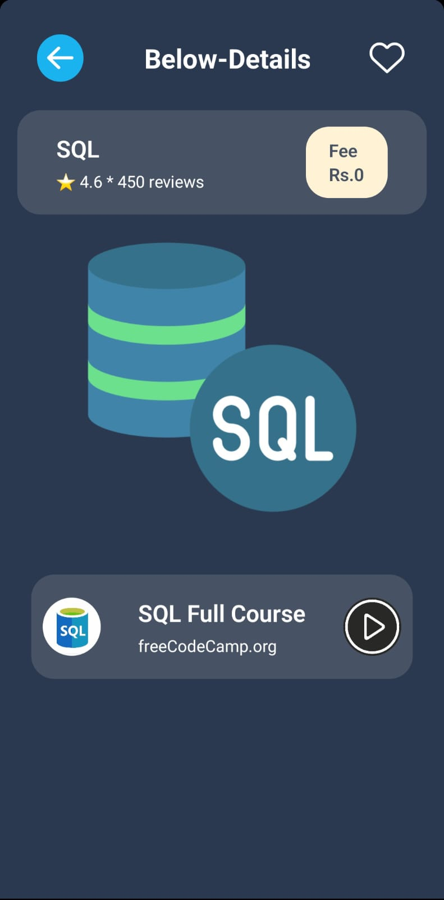

  
  
  

This is a new <strong><a href="https://reactnative.dev" target="_blank">React Native</a></strong> project, bootstrapped using <code>@react-native-community/cli</code>.

<h1>Getting Started</h1>

<strong>Note:</strong> Make sure you have completed the <a href="https://reactnative.dev/docs/environment-setup" target="_blank">React Native - Environment Setup</a> instructions till "Creating a new application" step, before proceeding.

<h2>Step 1: Start the Metro Server</h2>

First, you will need to start <strong>Metro</strong>, the JavaScript <em>bundler</em> that ships <em>with</em> React Native.

To start Metro, run the following command from the <em>root</em> of your React Native project:

<pre><code># using npm
npm start

# OR using Yarn
yarn start
</code></pre>

<h2>Step 2: Start your Application</h2>

Let Metro Bundler run in its <em>own</em> terminal. Open a <em>new</em> terminal from the <em>root</em> of your React Native project. Run the following command to start your <strong>Android</strong> or <strong>iOS</strong> app:

<h3>For Android</h3>

<pre><code># using npm
npm run android

# OR using Yarn
yarn android
</code></pre>

<h3>For iOS</h3>

<pre><code># using npm
npm run ios

# OR using Yarn
yarn ios
</code></pre>

If everything is set up <em>correctly</em>, you should see your new app running in your <strong>Android Emulator</strong> or <strong>iOS Simulator</strong> shortly, provided you have set up your emulator/simulator correctly.

This is one way to run your app — you can also run it directly from within Android Studio and Xcode, respectively.

<h2>Step 3: Modifying your App</h2>

Now that you have successfully run the app, let's modify it.

<ol>
  <li>Open <code>App.tsx</code> in your text editor of choice and edit some lines.</li>
  <li>For <strong>Android</strong>: Press the <kbd>R</kbd> key twice or select <strong>"Reload"</strong> from the <strong>Developer Menu</strong> (<kbd>Ctrl</kbd> + <kbd>M</kbd> on Windows/Linux, or <kbd>Cmd ⌘</kbd> + <kbd>M</kbd> on macOS) to see your changes!</li>
  <li>For <strong>iOS</strong>: Hit <kbd>Cmd ⌘</kbd> + <kbd>R</kbd> in your iOS Simulator to reload the app and see your changes!</li>
</ol>

<h2>Congratulations! 🎉</h2>

You've successfully run and modified your React Native App. 🎉

